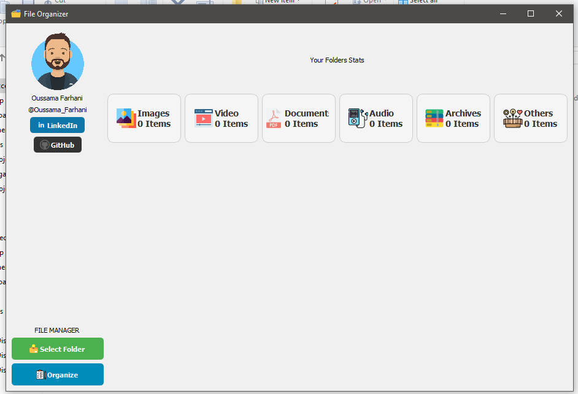

# File Organizer

File Organizer is a desktop application built using Python and PyQt5. It helps you organize files in a selected directory based on their extensions. The application categorizes files into folders such as Images, Videos, Documents, Audio, Archives, and Others.

## Features

- **Select Folder**: Choose a directory to organize.
- **Organize Files**: Automatically move files into categorized folders based on their extensions.
- **Folder Statistics**: View the number of files in each category before organizing.
- **Social Media Links**: Quick access to LinkedIn and GitHub profiles.

## Installation

1. **Clone the repository**:
   ```bash
   git clone https://github.com/oussamaF01/file-organizer.git
   cd file-organizer
   ```

2. **Install dependencies**:
   ```bash
   pip install -r requirements.txt
   ```

3. **Run the application**:
   ```bash
   python file_organizer.py
   ```

4. **Build the executable** (optional):
   You can create an executable using `PyInstaller`:
   ```bash
   pyinstaller --onefile --windowed --icon=icon/pngegg.ico file_organizer.py
   ```

## Usage

1. Launch the application.
2. Click on **Select Folder** to choose the directory you want to organize.
3. View the statistics of files in the selected folder.
4. Click **Organize** to categorize files into respective folders.

## Screenshots

### Main Interface


### Organized Files


## Author

- **Oussama Farhani**  
  - LinkedIn: [@Oussama_Farhani](https://www.linkedin.com/in/oussama-farhani-23ba13306/)
  - GitHub: [oussamaF01](https://github.com/oussamaF01)
